# Healthy Change

View README in:

- **English**
- [Polski](README_pl.md)

Application written for the Hack Heroes coding contest

## About the Application

The application allows you to record your health and food activities such as
exercise, meals and water consumption. It is also possible to obtain information
about a given food product (nutrients). All this is calculated and analysed by
the program, which displays indicators (caloric balance and body hydration) and
prompts for the user. All this in a clean, clean and aesthetic interface.

## Sample screenshots

**Note**: As the application only supports the Polish language at the time of writing, all screenshots are in Polish. To give you an idea what the screenshots show, each screenshot comes with a high-level overview of what the screen is displaying.

|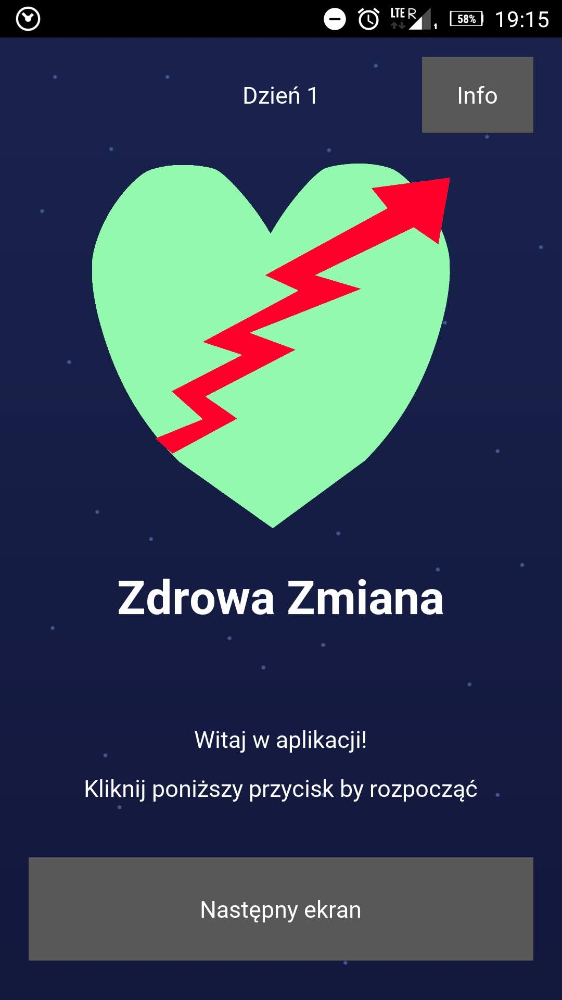</img>|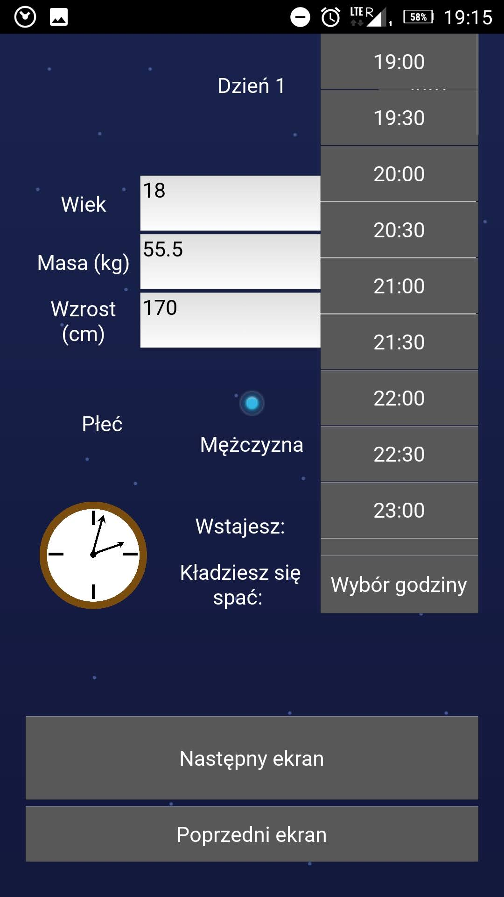</img>|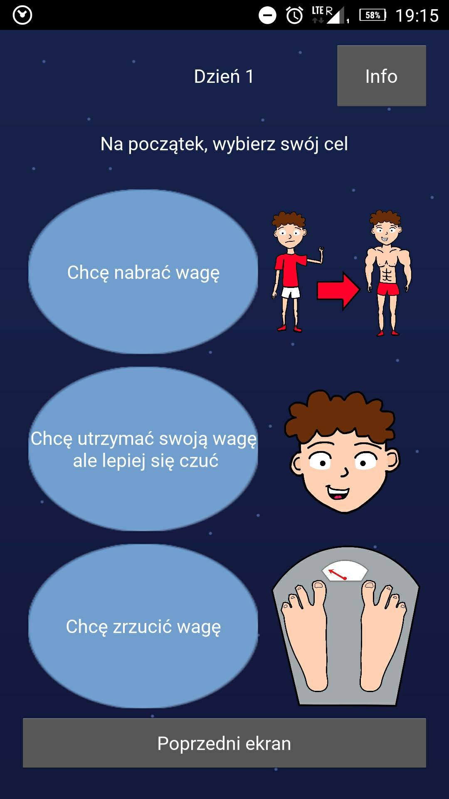</img>|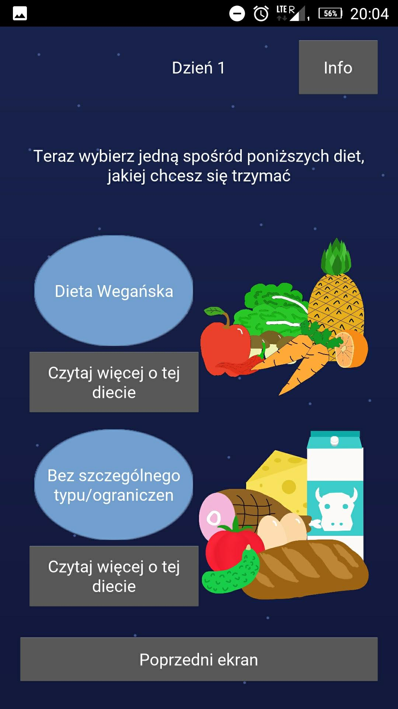</img>|
|--|--|--|--|
|First-time startup screen|Setting up the user profile, including age, mass, height, gender wake-up and sleep times|Setting the fitness goal|Selection the user's diet, two example diets implemented: vegan and "no restrictions"|

|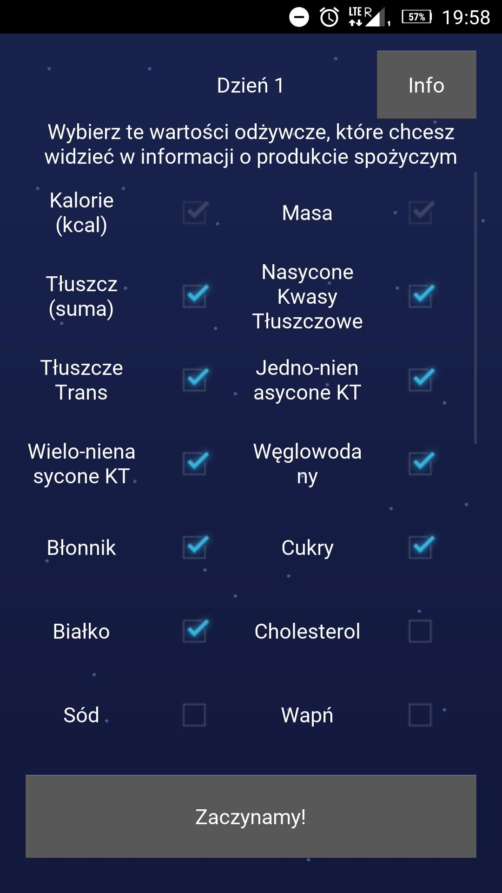</img>|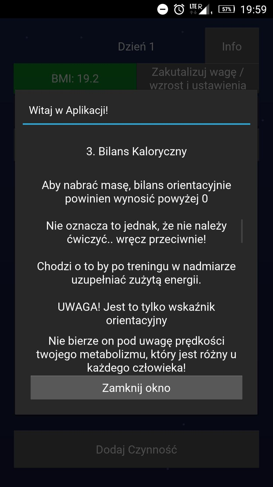</img>|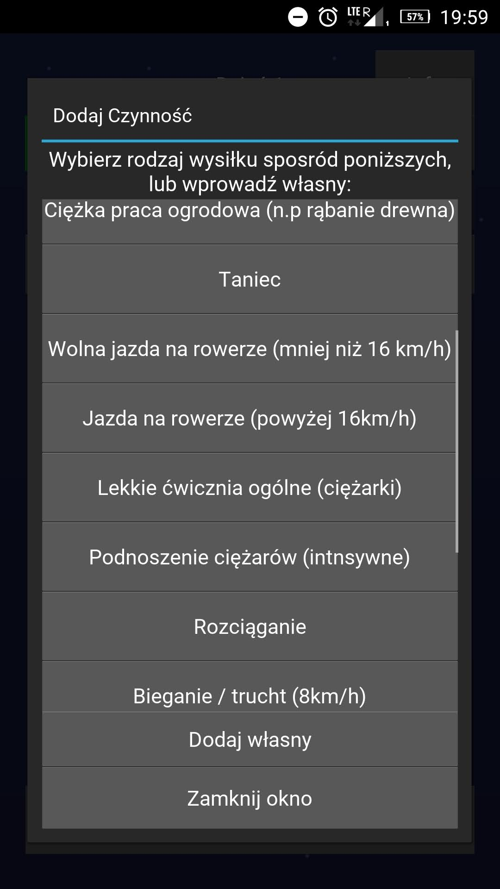</img>|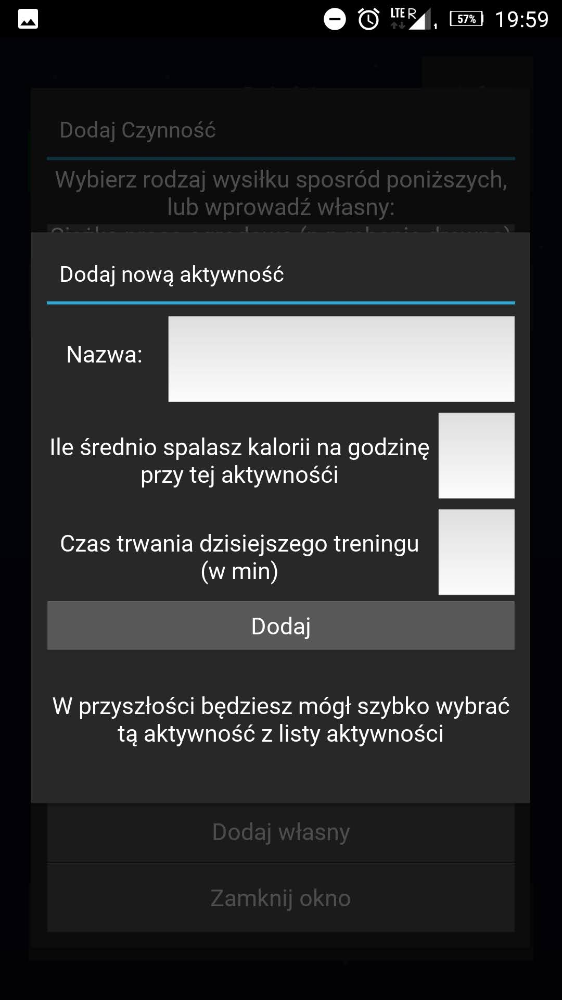</img>
|--|--|--|--|
|Selecting the nutritional data to be displaye dby default for each food item|Introduction popup in the dashboard informing on how to use the app|Selecting a physical activity from the list of saved activities.|Adding a new (custom) activity|

|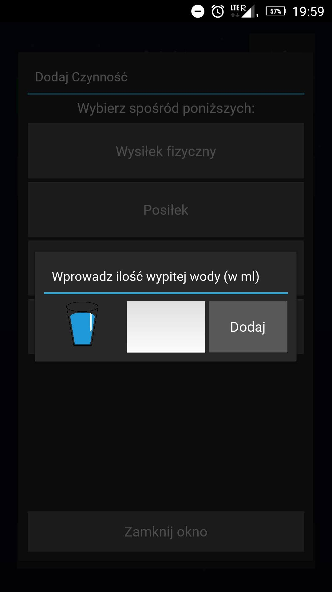</img>|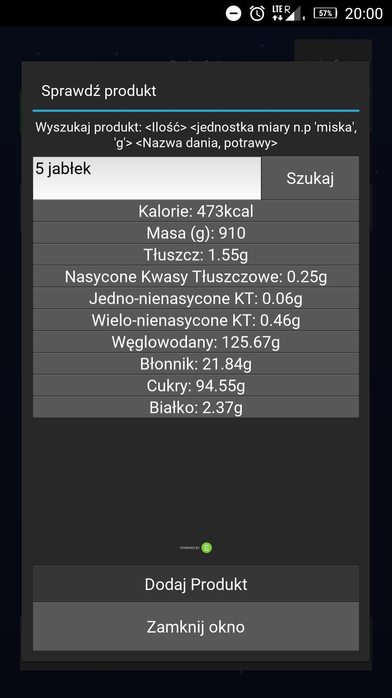</img>|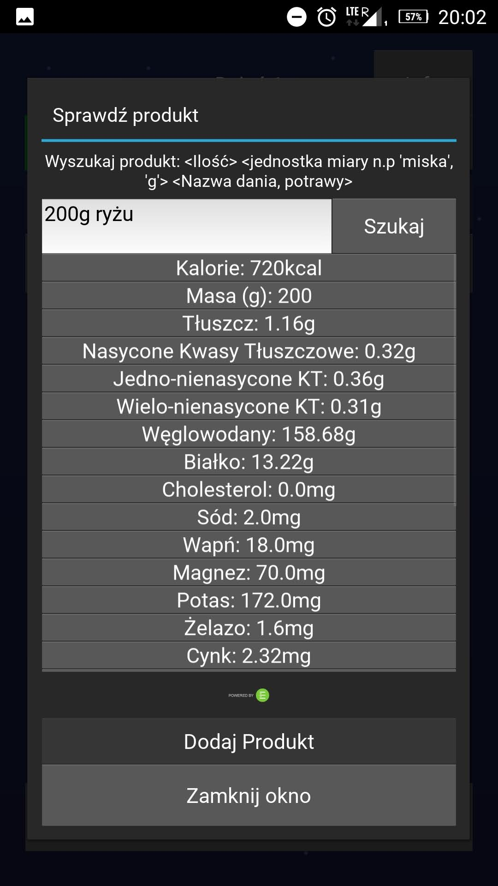</img>|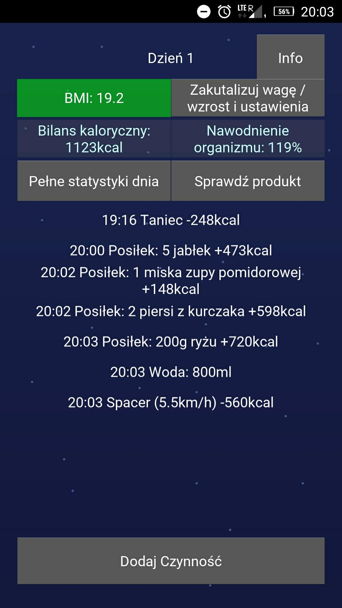</img>|
|--|--|--|--|
|Logging the drinkage of water|Checking nutritional value of 5 apples (API call made)|Checking nutritional value of 200g of rice|Dashboard with daily logs|

|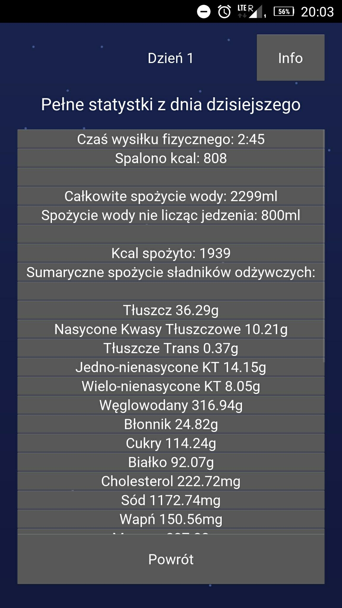</img>|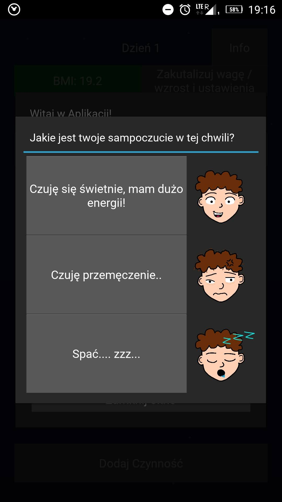</img>|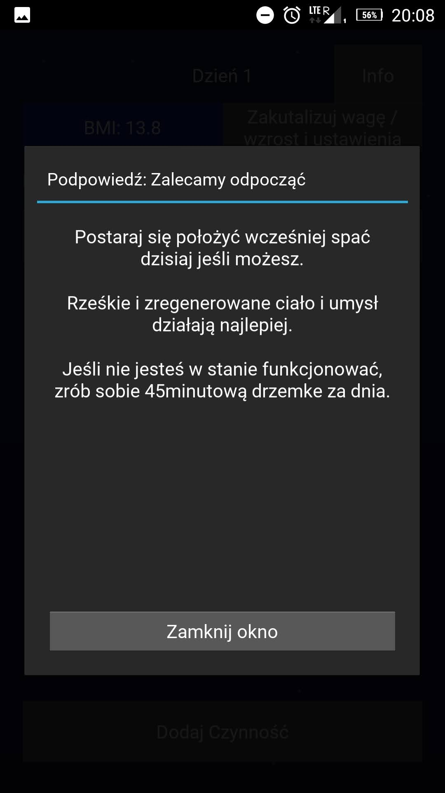</img>|
|--|--|--|
|Daily summary: stats of the whole day, both in terms of exercise and food|Asking the user for their mood at certain specific times during the day|Feedback for next day based on logged activities and mood check|

## Installation instructions for Android devices:

1. Download the .apk file `zdrowazmiana-0.1.x-armeabi-v7a-debug.apk` on the
   device (where x is the latest version)
2. Enable the "Allow installation of applications from unknown sources" option
   in the system settings
3. Open the file (via the installation manager) and click "Install"

## Full instructions on how to use the application
These instructions are also found inside the app

Attention! All statistics and hints are approximate only. We recommend that you
use common sense when using the application :)

#### How to use the application? Individual elements of the main screen:

##### 1. BMI indicator
At the top of the screen there is a coloured BMI with your BMI value

- Blue color: Underweight
- Green color: Normal weight
- Orange color: Slightly overweight
- Red color: Overweight

If your goal is to build a lot of muscles, don't worry about this indicator

##### 2. Weight or height update and setting
You can update your weight and height information at any time. You can also
change the displayed nutrients in the food here. In addition, if you want to
display the instructions again, this option is also here. To delete data and /
or start over, click the appropriate button in "Settings".

##### 3. Caloric balance
ATTENTION! This is only an indication. It does not take into account your
metabolic speed, which differs from person to person! The balance updates
after training, after a meal, and when idle.

##### 4. Body hydration index
Ideally, the ratio should be around 100%, although above 100% is also okay, of
course. If it is below 20%, your body may become dehydrated soon. The indicator
changes its color in the event of dehydration or close to it. Water can be
replenished simply by drinking water or by consuming food containing water.
Water is constantly lost by the body, so it should be replenished regularly,
especially during and after exercise!

##### 5. Complete stats of the day
Here you will find a daily summary of your day, statistics on exercise, water
consumption, and each individual food ingredient consumed during the day.

##### 6. Check the product (Requires internet connection)
Here you can search for virtually any food item by following the provided search
syntax. It is important to indicate the quantity of the product, be it in
pieces, grams or even in bowls. After the search, the nutritional values ​​of
the product that you selected earlier are displayed. If you have eaten this
product, feel free to add to "meals eaten today"

##### 7. Main screen
All activities you add during the day will be displayed in the center of the
screen.

##### 8. Adding Activities
You can add activities such as exercise, a meal, and a drink of water. There are
a dozen built-in physical activities in the app, but you can always add and save
your own

##### 9. Notifications about well-being
In the afternoon and in the evening, pop-ups will be displayed asking you about
your well-being. After choosing how you feel, we show you tips for the afternoon
or for the next day.

## Artwork author

Marcel Jarosik
